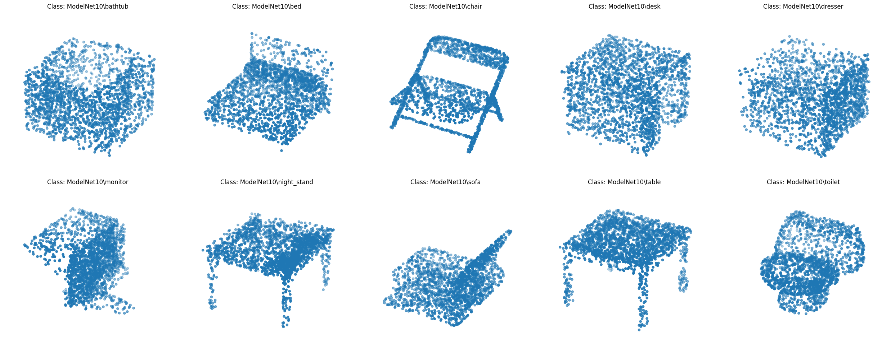

# Introduction

Classification, detection and segmentation of unordered 3D point sets i.e. point clouds is a core problem in computer vision. This example implements the seminal point cloud deep learning paper PointNet (Qi et al., 2017). For a detailed intoduction on PointNet see this blog post.

# Data

## ModelNet10

ModelNet10.zip: this ZIP file contains CAD models from the 10 categories used to train the deep network in our 3D deep learning project. Training and testing split is included in the file. The CAD models are completely cleaned inhouse, and the orientations of the models (not scale) are manually aligned by ourselves.

| ID | Class name       | 
|----------|----------------|
| 1        | Bathtub| 
| 2        | Table  | 
| 3        | Toilet| 
| 4        | Night Stand |
| 5        |Sofa   | 
| 6        |Dresser | 
| 7        | Chair  | 
| 8        | Desk    | 
| 9        |Bed      | 
| 10       | Monitor | 

After sampling from the original image

# Model

## PointNet and PointNet++

### PointNet

### PointNet++

